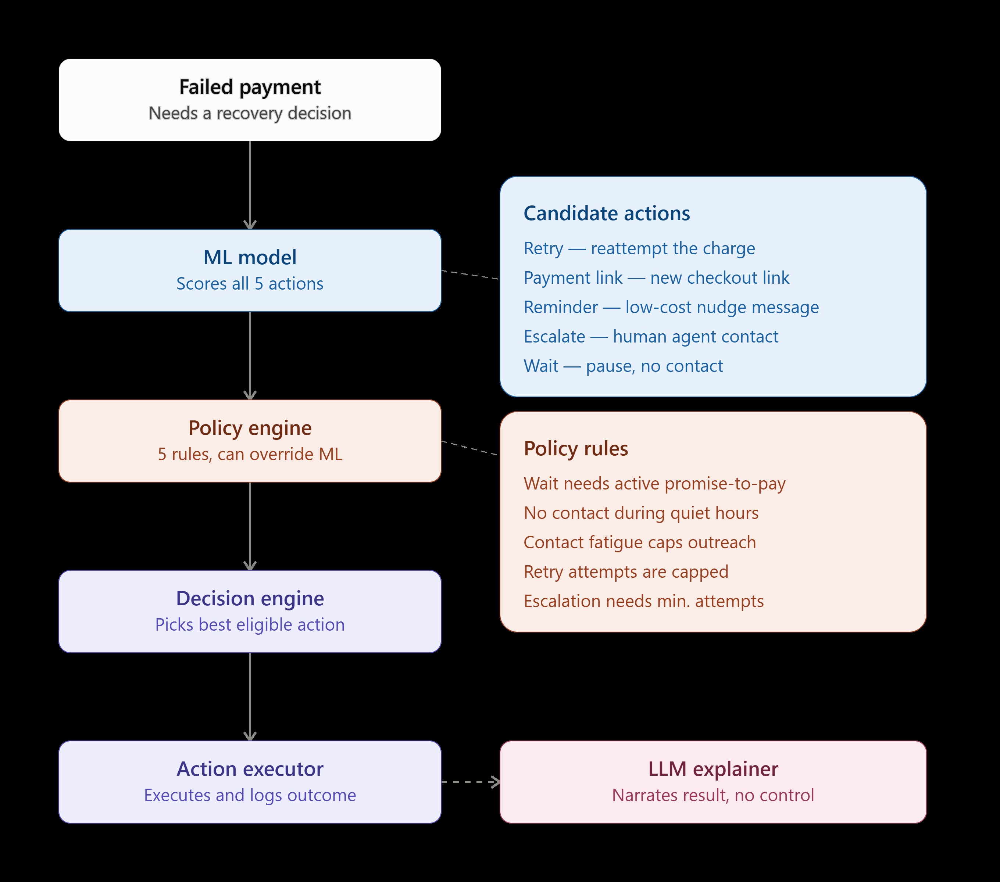

# RecoverIQ: Policy-Constrained AI Revenue Recovery

*ML proposes. Policy decides. AI explains.*

Built for the **Razorpay AI Buildathon 2026 - Track 03: AI Revenue Recovery**.

---

## Problem / What It Solves

Involuntary payment failures — expired cards, insufficient funds, gateway timeouts — cause recurring revenue loss even when the customer has no intention of churning.

Naive recovery systems treat every failed payment the same way: retry, remind, escalate. This ignores transaction value, customer history, contact fatigue, and the fact that different failures respond to different interventions. The question isn't simply *"will this payment recover?"* — it's *"given this failed payment, which recovery action is most valuable while remaining safe and policy-compliant?"*

## Objective

Maximize **expected recovered revenue**, subject to deterministic business and safety constraints. Prediction and authorization are treated as two separate jobs, not one.

## What RecoverIQ Does

For every failed payment, RecoverIQ:

1. **Scores five candidate recovery actions** — `retry`, `payment_link`, `reminder`, `escalate`, `wait` — using an ML model trained on transaction and customer-history features.
2. **Computes expected recovery value** for each action: `amount × predicted recovery probability`.
3. **Runs every candidate through a deterministic policy engine** of five explicit rules. Policy can override the model's top-scoring action.
4. **Selects the highest-value action that policy actually allows.** Only policy-approved decisions reach the executor.
5. **Executes the decision through a policy-gated executor** and records a full audit trail (`DecisionResult` + `ExecutionResult`).
6. **Explains the finalized decision** through a bounded Gemini-powered assistant, which has no code path back into the decision.

## Architecture

```text
Failed payment
      |
      v
  ML model  -- scores all 5 actions, computes expected recovery value
      |
==================================================
 TRUST BOUNDARY: prediction ends, decision authority begins
==================================================
      |
      v
 Policy engine  -- 5 deterministic rules, can override the model
      |
      v
Decision engine -- selects the best action among ELIGIBLE actions only
      |
==================================================
 TRUST BOUNDARY: decision is final, execution begins
==================================================
      |
      v
Action executor -- simulated execution, requires policy approval
      |
      v
Structured audit -- DecisionResult + ExecutionResult
      |
==================================================
 TRUST BOUNDARY: decision is finalized, everything below is explanation only
==================================================
      |
      v
Deterministic decision insights (pure Python, no model/policy call)
      |
      v
Gemini assistant -- plain-English explanation, no control
      |
      v
Streamlit dashboard -- read-only presentation
```



## Key Results

All figures below come from `outputs/full_policy_comparison.json`, produced by `run_full_policy_evaluation.py` running the real `DecisionEngine` + `PolicyEngine` + `ActionExecutor` stack against the 300-row synthetic holdout set (`data/holdout_full_matrix.csv`), whose ground-truth recovery probabilities are known by construction.

| Metric | Value |
|---|---|
| Holdout transactions evaluated | 300 |
| **% of oracle revenue (full system)** | **85.0%** |
| Policy override rate | 65.7% |
| Exact action-match rate vs. oracle | 50.7% |
| Mean regret vs. oracle | 0.0919 |
| Mean chosen true recovery probability | 46.63% |
| System revenue | ₹1,273,814.56 |
| Oracle revenue (theoretical best-possible) | ₹1,498,542.16 |
| Total amount at risk | ₹2,596,602.03 |
| Decision status breakdown | 300 decided, 0 held for manual review |
| Execution status breakdown | 300 executed, 0 rejected |

**"% of oracle revenue" is a revenue-share ratio against a hypothetical best-possible-action benchmark — it is not a recovery rate and should not be read as one.** No single figure above claims a fraction of transactions that recovered; `mean_chosen_true_prob` (46.63%) is the closest thing to an average recovery probability.

**A high (65.7%) policy override rate is evidence the policy layer is doing real, active work** — it means that on nearly two-thirds of transactions, the deterministic policy layer selected something other than the model's raw top pick, rather than simply rubber-stamping the model.

### Important distinction: 91.7% vs. 85.0%

An earlier, intermediate Day 2 analysis (`src/evaluate_policy.py`, output in `outputs/policy_comparison.json`) applied **only the WAIT-eligibility rule** as a post-hoc score mask on the raw model, and reached **≈91.7% of oracle revenue**. This number is **not** the final system result — it reflects one rule in isolation, evaluated before the full policy engine (quiet hours, contact fatigue, retry caps, escalation minimums) existed. The complete system, evaluated with all five rules through the real `PolicyEngine`, achieves **85.0%** — lower, because more rules block more of the model's top picks, forcing more fallback to lower-scoring-but-eligible actions. **85.0% is the correct number to cite as RecoverIQ's result.**

### Baseline comparison

Computed directly from the holdout's `true_prob_*` columns (`app.py`, no `DecisionEngine`/`PolicyEngine` involved):

| Baseline | % of oracle revenue |
|---|---|
| **Passive/WAIT baseline** — `wait` applied to every transaction, regardless of eligibility | ≈43.9% |
| Naive historical rule — deterministic replay of the original logging policy's branches | ≈59.0% |
| **RecoverIQ (full system)** | **85.0%** |
| Oracle (theoretical best-possible action per transaction) | 100% |

The passive baseline is explicitly named **"Passive/WAIT baseline,"** not "no action" — `wait` is a real candidate action in this system, not the absence of one.

## Selection-Bias Demonstration

The historical logged dataset (`data/logged_transactions.csv`, 800 rows) was generated by a deliberately naive logging policy (`simulator/logging_policy.py`) that never looks at transaction amount or failure reason. This produces real, measurable selection bias:

- `payment_link` was chosen in only **~4.9%** of historical transactions (39/800), yet is the oracle-optimal action for **~52.7%** of holdout transactions (158/300).
- Every logged `wait` example (81/81, zero counterexamples) has `active_promise_to_pay=True`. The training data contains no example of `wait` being used without an active promise-to-pay.
- As a direct result, the raw (unconstrained) ML model over-recommends `wait`: on the holdout set it selects `wait` for **175 of 259** transactions where `active_promise_to_pay=False` (`outputs/policy_comparison.json`, `wait_selected_rate_when_ptp_false`) — a case the model never saw a disconfirming example of. This is exactly the failure mode the deterministic WAIT-eligibility policy rule exists to catch.

## Counterfactual Evaluation

`data/holdout_full_matrix.csv` stores the **true recovery probability for all five actions on every one of 300 transactions** — including the four actions that were never actually taken — generated by a hidden reward function (`simulator/reward_function.py`). This is what makes it possible to measure "how much revenue was left on the table" against a theoretical oracle, something no real transaction log alone can provide (you only ever observe the outcome of the one action actually chosen).

This is a **controlled, synthetic proof-of-concept evaluation** against known, hand-designed ground truth. It demonstrates that the policy-constrained system measurably outperforms naive baselines and the raw model **within this controlled environment**. It is **not** evidence of real-world/production generalization, and is not a substitute for evaluation on real payment data.

## Decision Pipeline

`src/decision_engine.py`'s `DecisionEngine.decide()`:

1. **Validate** the incoming transaction (`src/schemas.py`); malformed input is rejected before scoring.
2. **Score all five actions** with the trained model (`ml_scores`).
3. **Compute expected recovery value** per action (`amount × ml_score`).
4. **Check policy eligibility** for every action (`src/policy_engine.py`).
5. **Select the final action** — the highest-scoring action **among eligible actions only**, never the model's raw top pick directly.
6. **Record the audit trail** (`DecisionResult`), including the model's raw recommendation, the final action, whether policy overrode it, and why.

Four distinct concepts are tracked separately and must not be conflated:
- **ML recommendation** (`model_recommendation`) — the model's top-scoring action, ignoring eligibility.
- **Expected recovery value** — `amount × probability`, computed for all five actions.
- **Policy eligibility** — which actions are actually allowed, and why not for the rest.
- **Final action** (`final_action`) — the highest-value action among eligible ones; `None` if none are eligible.

If every action is blocked, `final_action` is `None` and the transaction's status becomes `held_for_manual_review` — the system never forces an unsafe fallback action.

## Policy Engine / Safety Constraints

`src/policy_engine.py` implements five deterministic rules. Each is a plain comparison against a fixed constant — no learned parameters, same input always produces the same output:

| Rule | Condition |
|---|---|
| WAIT eligibility | `wait` is blocked unless `active_promise_to_pay` is true |
| Quiet hours | Customer-contact actions (`payment_link`, `reminder`, `escalate`) are blocked during quiet hours; `retry` and `wait` are unaffected (they don't contact the customer) |
| Contact fatigue | Customer-contact actions are blocked once `contact_count_last_7_days` reaches the configured limit |
| Retry cap | `retry` is blocked once `prior_recovery_attempts` reaches the configured cap |
| Escalation minimum | `escalate` requires a minimum number of prior recovery attempts before it becomes eligible |

A non-blocking advisory flag (`flagged_for_review`) can also mark high-value transactions for human attention without ever affecting eligibility or the final action.

Policy rules can override the model's top recommendation; the model can never override a policy block.

## Action Execution and Audit Trail

`src/action_executor.py`'s `ActionExecutor` only accepts a validated policy approval (a `PolicyCheckResult`), not a raw action string — this closes the accidental path where a caller could execute an arbitrary, unapproved action. Every execution attempt (approved, blocked, duplicate, or unknown) produces a structured `ExecutionResult`, and repeated calls for the same transaction ID are idempotent rather than re-executed.

**This is a simulation.** `ExecutionResult.simulation` is always `True`. No real payment gateway, messaging service, or customer contact is integrated anywhere in this codebase.

**Known prototype trust limitation:** the executor trusts the `PolicyCheckResult` object it is given — it does not itself re-derive eligibility. A caller who deliberately constructs a fabricated approval object (rather than obtaining one from `PolicyEngine`) could bypass this check; only *accidental* misuse (e.g. passing a bare action string) is prevented. Closing this fully — for example, making `PolicyCheckResult` constructible only from within `PolicyEngine` — is documented here as future production hardening rather than implemented, since it was judged disproportionate to this prototype's scope.

## Bounded Gemini Explanation Layer

`src/llm_explainer.py` (Gemini, via the `google-genai` SDK, model `gemini-flash-latest`) narrates an **already-finalized** decision in plain English. It receives a structured JSON context — the model's scores, the policy checks and reasons, the final action, and whether an override occurred — and returns a short explanation string.

**Architectural trust boundary, not a claimed inability:** `src/llm_explainer.py` contains no import of `PolicyEngine`, `DecisionEngine`, or `ActionExecutor`. There is no code path by which its output could construct a policy approval, call the executor, or modify `final_action` — the decision is already complete by the time this module runs. The Gemini layer can only ever produce a string that is displayed to the user; nothing in the dashboard writes that string back into any decision state.

A small, fixed set of pre-approved questions ("Why was this action selected?", "Why wasn't WAIT selected?", "Why was the model recommendation overridden?", "Which policy rule affected this decision?", "What was the strongest eligible alternative?") plus a separate batch-summary feature are the only supported interactions — there is no free-text/unrestricted chat interface.

The Gemini API key is read from `GEMINI_API_KEY` in a local `.env` file (loaded via `python-dotenv`), is never hardcoded, logged, or displayed, and `.env` is excluded from version control.

## Dashboard

`app.py` (Streamlit) is a read-only presentation layer over the components above — it does not reimplement any scoring or policy logic. It runs the real `DecisionEngine`/`ActionExecutor` over all 300 holdout transactions, and additionally draws **one seeded Bernoulli outcome per transaction** (fixed seed, against the holdout's true recovery probability for the chosen action) purely as a demonstration mechanism.

**This seeded outcome is explicitly a demonstration, not an observed real payment result** — it is a different concept and a different number from the 85.0%/65.7% counterfactual evaluation figures above, which are computed from expected probabilities, not from any random draw. The dashboard's own captions state this distinction directly, and it should not be quoted as if it were the system's headline result.

The dashboard shows: top-level metrics, the baseline comparison, an interventions breakdown, a recovery-outcomes breakdown, a per-transaction trace (ML scores, expected recovery values, policy checks, the model-vs-final-action flow with override status), and the Gemini explanation/bounded-question interface.

## Testing

```
python -m unittest discover -s tests -v
```

48 tests across four suites:
- `tests/test_policy_engine.py` — every policy rule's exact boundary condition.
- `tests/test_decision_engine.py` — normal transactions, malformed input, the WAIT-override case, all-actions-blocked → manual review, idempotency.
- `tests/test_action_executor.py` — approved/blocked/duplicate/unknown-action execution states.
- `tests/test_decision_insights.py` — the deterministic explanation-insight helpers, including an explicit test that they cannot mutate a `DecisionResult`, and integration checks against the real holdout run and `outputs/full_policy_comparison.json`.

## Project Structure

```
recoveriq/
├── app.py                          Streamlit dashboard
├── run_full_policy_evaluation.py   Authoritative full-stack evaluation script
├── requirements.txt
├── docs/
│   └── recoveriq_architecture.jpg  Architecture diagram
├── data/
│   ├── logged_transactions.csv     800 historical (biased) transactions
│   └── holdout_full_matrix.csv     300 counterfactual holdout transactions
├── simulator/
│   ├── generate_data.py            Builds the two datasets above
│   ├── logging_policy.py           The naive historical logging policy
│   └── reward_function.py          Hidden ground-truth recovery model
├── src/
│   ├── features.py                 Shared ML feature contract
│   ├── train_model.py              Trains and selects the recovery model
│   ├── evaluate_policy.py          Day 2 WAIT-masked evaluation
│   ├── schemas.py                  Transaction / DecisionResult / ExecutionResult
│   ├── policy_engine.py            The five deterministic policy rules
│   ├── decision_engine.py          validate → score → policy → select → audit
│   ├── action_executor.py          Policy-gated simulated execution
│   ├── batch_runner.py             Batch loop over DecisionEngine.decide()
│   ├── decision_insights.py        Deterministic insight helpers for the LLM layer
│   └── llm_explainer.py            Gemini explanation layer
└── tests/                          48 unit tests
```

`models/` and `outputs/` are generated artifacts (excluded from version control via `.gitignore`) — see "How to Run" to regenerate them.

## Tech Stack

Python 3.10, scikit-learn, pandas, numpy, joblib (ML), Streamlit + matplotlib (dashboard), `google-genai` + `python-dotenv` (Gemini explanation layer). Exact pinned versions are in `requirements.txt`.

## How to Run

```bash
pip install -r requirements.txt
```

Create a `.env` file in the repository root containing:
```
GEMINI_API_KEY=your_key_here
```

`data/` is already populated in this repository. `models/` and `outputs/` are gitignored and must be generated locally:

```bash
cd src
python train_model.py        # writes models/recovery_model.joblib, models/train_metadata.json
python evaluate_policy.py    # writes outputs/policy_comparison.csv / .json
cd ..
python run_full_policy_evaluation.py   # writes outputs/full_policy_comparison.csv / .json
```

Run the dashboard:
```bash
streamlit run app.py
```

Run the tests:
```bash
python -m unittest discover -s tests -v
```

To regenerate the source datasets from scratch (not required — they are already committed):
```bash
cd simulator
python generate_data.py
```

## Limitations

- **All data is synthetic.** Transaction features, the historical logging policy, and every recovery probability come from a hand-designed simulator (`simulator/`), not real payment data.
- **No real payment execution.** `ActionExecutor` is simulation-only; no payment gateway, messaging, or customer-contact integration exists.
- **In-memory idempotency only.** Duplicate-transaction protection in `DecisionEngine` and `ActionExecutor` is a per-process dictionary; it does not persist across restarts or across multiple processes.
- **No persistent audit database.** Audit records exist only for the lifetime of the running process.
- **Executor trust limitation.** As described above, deliberate forgery of a policy approval object is not prevented — only accidental misuse is.
- **Gemini availability depends on API quota.** The explanation layer degrades gracefully (a clear, sanitized "unavailable" message) if the API is rate-limited or unreachable, but does not include a fallback LLM provider.
- **This is a buildathon prototype, evaluated entirely on synthetic data.** It has not been validated on real payment data, has no production monitoring, and no claim of production readiness is made.

## Future Work

- Persistent, queryable audit storage in place of in-memory caches.
- Stronger executor authorization (e.g. policy approvals constructible only from within `PolicyEngine`) to close the deliberate-forgery gap noted above.
- Real payment gateway / messaging integration, gated behind the existing policy layer.
- An expanded policy rule set reflecting real regulatory and card-network constraints.
- Live or shadow-mode evaluation against real transaction data before any production performance claim.

## Core Design Principle

**ML predicts. Policy controls. Executor executes. LLM explains.**

Each component has authority over exactly one part of the decision, and no more:

| Component | Has authority over | Does not have authority over |
|---|---|---|
| ML model | A probability estimate per action | Whether that action may run |
| Policy engine | Eligibility of each action, with a reason | Which eligible action scores best |
| Decision engine | Combining the above into one final action | Overriding a policy block |
| Action executor | Simulated execution of an already-approved action | Deciding what to execute |
| Gemini explanation layer | Producing explanatory text | The final action, or anything upstream of it |
